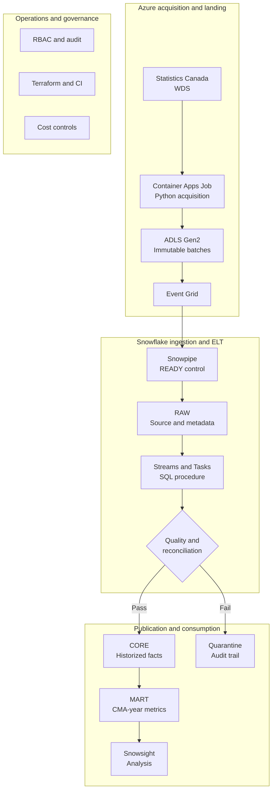

# Canadian Regional Intelligence on Snowflake

[](https://github.com/ruizhaoca/canadian-regional-intelligence-snowflake/actions/workflows/ci.yml)

A portfolio-grade data engineering platform that combines Canadian metropolitan-area population and labour-market data to answer a practical question: **how are population growth and labour-market conditions changing together across Canadian CMAs?**

The MVP demonstrates event-driven ingestion on Azure, immutable and idempotent landing, Snowflake ELT, data quality controls, dimensional modeling, infrastructure as code, CI, RBAC, and cost-aware operations.

## MVP workflow



## Authoritative data sources

| Table | Purpose | Grain used by the MVP |
|---|---|---|
| [14-10-0461-01](https://www150.statcan.gc.ca/t1/tbl1/en/tv.action?pid=1410046101) | Labour force characteristics by census metropolitan area, annual | CMA × year × labour characteristic |
| [17-10-0148-01](https://www150.statcan.gc.ca/t1/tbl1/en/tv.action?pid=1710014801) | Population estimates, July 1, by CMA and CA, 2021 boundaries | CMA × year × demographic measure |

The acquisition service resolves official full-table CSV downloads through the [Statistics Canada Web Data Service](https://www.statcan.gc.ca/en/developers/wds). It does not scrape web pages.

## Verified live MVP results

The DEV pipeline was exercised end to end on Azure and Snowflake on August 13, 2026.

| Dataset | Source rows | Conformed rows | Quality checks | Reconciled | Final status |
|---|---:|---:|---:|---|---|
| Labour market | 174,150 | 4,301 | 3/3 passed | Yes | `PUBLISHED` |
| Population | 1,819,875 | 1,025 | 3/3 passed | Yes | `PUBLISHED` |
| **Total** | **1,994,025** | **5,326** | **6/6 passed** | **Yes** | **2/2 published** |

The analytical mart contains 615 rows: a complete panel of 41 CMAs across 15 annual periods from 2011 through 2025. An immediate replay of both immutable source archives returned `SKIPPED`, demonstrating content-addressed idempotency before Snowflake loading.

See [docs/evidence.md](docs/evidence.md) for the acceptance evidence and interpretation of source, conformed, and mart record counts.

## Local validation

```powershell
python -m venv .venv
.\.venv\Scripts\Activate.ps1
python -m pip install -e ".[dev]"
ruff check .
mypy
pytest
sqlfluff lint --ignore-local-config --config .sqlfluff sql
```

To exercise the official StatsCan acquisition without any cloud writes:

```powershell
python -m regional_intelligence --local-output data\landing
```

The second identical run reports `SKIPPED` for both content-addressed batches.

## Repository layout

```text
.
|-- .github/workflows/          # CI checks
|-- docs/                       # Architecture and operational guidance
|-- infra/
|   |-- azure/                  # Azure DEV Terraform
|   `-- snowflake/              # Snowflake DEV Terraform
|-- scripts/                    # Bootstrap and deployment helpers
|-- sql/
|   |-- 10_raw/                 # Snowpipe control and source tables
|   |-- 20_core/                # History, quality gate, Stream, Task
|   |-- 30_marts/               # CMA analytical model
|   |-- 40_monitoring/          # Operational views
|   `-- 90_verification/        # Acceptance queries
|-- src/regional_intelligence/  # Python acquisition package
`-- tests/                      # Automated tests
```

## Deployment

The ordered, two-pass cloud deployment and teardown procedure is documented in [docs/deployment.md](docs/deployment.md). The successful DEV acceptance run is documented in [docs/evidence.md](docs/evidence.md).
